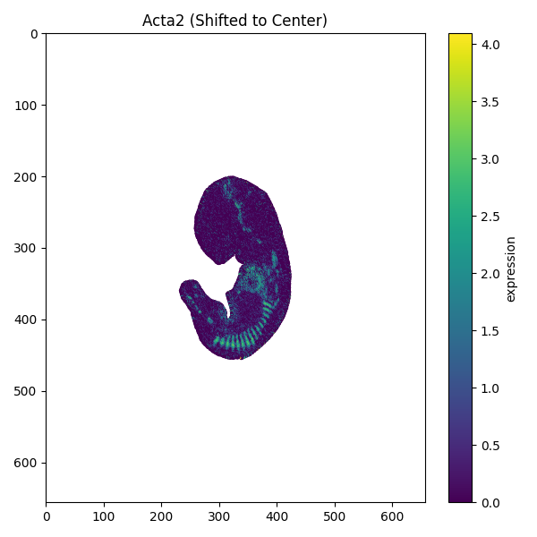

## Cell Gene Expression Diffusion

This repository contains the code for the paper "Cell Gene Expression Diffusion".


### Running
First, you need to install the requirements
```bash
pip install -r requirements.txt
```

To load the dataset you need to load both the hf dataset and also the spatial coordinates. The reaons for this
choice is that most of the gene expressions in most spatial locations are zero, so we use a global spatial coordinate file
and then fill it out using the values from the hf dataset. This is done to save space and time.
```python
from datasets import load_from_disk
import numpy as np
import matplotlib.pyplot as plt


dataset = load_from_disk("data/E11.5_E1S4/combined_dataset.hf")
spatial_coords = np.load("data/E11.5_E1S4/spatial_coords.npy")

square_size = 656

gene_record = dataset[0] # choose a gene record randomly
gene = gene_record["gene"]
# Create dense array of zeros
n_spots = spatial_coords.shape[0]
expression_map = np.zeros(n_spots, dtype=np.float32)

# Fill non-zero values
spot_indices, values = zip(*gene_record["matrix"])
expression_map[np.array(spot_indices, dtype=int)] = values

# Plot
xs, ys = spatial_coords[:, 0], spatial_coords[:, 1]
es = expression_map

plt.figure(figsize=(6, 6))
plt.scatter(xs, ys, c=es, cmap="viridis", s=1)
plt.title(f"{gene} (Shifted to Center)")
plt.xlim(0, square_size)
plt.ylim(0, square_size)
plt.gca().invert_yaxis()
plt.colorbar(label="expression")
plt.tight_layout()

```

The size of the ```square_size``` variable is previously calculated as the maximum of the spatial coordinates across all datasets.


